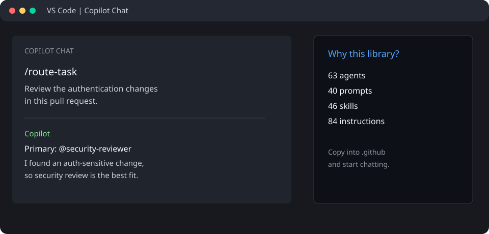

# GitHub Copilot Customization Library

Reusable GitHub Copilot agents, instructions, skills, and prompt files for software
development, reviews, debugging, architecture, testing, and documentation.

This is a meticulouly curated Copilot adaptation. I selected, rewrote, and organized
these files for Copilot's discovery model;

New to the library? Start with [Build a Website with Copilot](./WEBSITE-GUIDE.md).

## At A Glance

| Included | Count | Location |
| --- | ---: | --- |
| Custom agents | 63 | [`agents/`](agents/) |
| File instructions | 84 | [`instructions/`](instructions/) |
| Agent skills | 46 | [`skills/`](skills/) |
| Prompt files | 40 | [`prompts/`](prompts/) |

## Use It In Copilot Chat

Clone this repository into a project's `.github` folder, open that project in VS
Code, then run a prompt from Copilot Chat. For example, type `/route-task` and
describe the work. Copilot can route the request to the smallest useful specialist.

You can also invoke a specialist directly, such as `@code-reviewer`, or run a
prompt such as `/feature-dev` when it is available in your workspace.

## Structure

These are the folders that are actually checked in:

| Copilot primitive | Location | What it does |
| --- | --- | --- |
| Always-on instructions | [`copilot-instructions.md`](copilot-instructions.md) | Sets the library-wide operating guidance |
| Custom agents | [`agents/`](agents/) | Focused specialists invoked with `@name` |
| File instructions | [`instructions/`](instructions/) | Language and framework guidance applied to matching files |
| Agent skills | [`skills/`](skills/) | Reusable workflows and domain knowledge |
| Prompt files | [`prompts/`](prompts/) | Reusable slash commands invoked with `/name` |

## Agent Inventory

| Agent | Purpose |
| --- | --- |
| `a11y-architect` | Accessibility architecture and WCAG guidance |
| `architect` | General software architecture |
| `build-error-resolver` | Diagnose and resolve build failures |
| `code-architect` | Code-level design decisions |
| `code-explorer` | Explore unfamiliar codebases |
| `code-reviewer` | Review changes for bugs and regressions |
| `code-simplifier` | Reduce unnecessary complexity |
| `comment-analyzer` | Check comments for accuracy and value |
| `conversation-analyzer` | Analyze development conversations |
| `cpp-build-resolver` | Resolve C++ build problems |
| `cpp-reviewer` | Review C++ changes |
| `csharp-reviewer` | Review C# changes |
| `dart-build-resolver` | Resolve Dart build problems |
| `database-reviewer` | Review database and SQL changes |
| `django-build-resolver` | Resolve Django build problems |
| `django-reviewer` | Review Django changes |
| `doc-updater` | Update project documentation |
| `docs-lookup` | Find and apply documentation context |
| `e2e-runner` | Plan and run end-to-end checks |
| `fastapi-reviewer` | Review FastAPI changes |
| `flutter-reviewer` | Review Flutter changes |
| `fsharp-reviewer` | Review F# changes |
| `gan-evaluator` | Evaluate generative agent outputs |
| `gan-generator` | Generate generative agent artifacts |
| `gan-planner` | Plan generative agent work |
| `go-build-resolver` | Resolve Go build problems |
| `go-reviewer` | Review Go changes |
| `harmonyos-app-resolver` | Resolve HarmonyOS app issues |
| `harness-optimizer` | Optimize agent harness usage |
| `healthcare-reviewer` | Review healthcare software risks |
| `homelab-architect` | Design homelab systems |
| `java-build-resolver` | Resolve Java build problems |
| `java-reviewer` | Review Java changes |
| `kotlin-build-resolver` | Resolve Kotlin build problems |
| `kotlin-reviewer` | Review Kotlin changes |
| `loop-operator` | Operate iterative task loops |
| `marketing-agent` | Draft technical marketing content |
| `mle-reviewer` | Review machine-learning engineering changes |
| `network-config-reviewer` | Review network configuration |
| `network-troubleshooter` | Diagnose network problems |
| `opensource-packager` | Prepare open-source project packaging |
| `performance-optimizer` | Find performance improvements |
| `php-reviewer` | Review PHP changes |
| `planner` | Break complex work into plans |
| `pr-test-analyzer` | Analyze pull-request test coverage |
| `python-reviewer` | Review Python changes |
| `pytorch-build-resolver` | Resolve PyTorch build problems |
| `rag-pipeline-reviewer` | Review RAG pipeline changes |
| `react-build-resolver` | Resolve React build problems |
| `react-reviewer` | Review React changes |
| `refactor-cleaner` | Identify safe refactoring opportunities |
| `rust-build-resolver` | Resolve Rust build problems |
| `rust-reviewer` | Review Rust changes |
| `security-reviewer` | Review security-sensitive changes |
| `silent-failure-hunter` | Find swallowed or silent failures |
| `spec-miner` | Extract requirements from project context |
| `swift-build-resolver` | Resolve Swift build problems |
| `swift-reviewer` | Review Swift changes |
| `tdd-guide` | Guide test-driven development |
| `task-router` | Route work to the right specialist |
| `type-design-analyzer` | Analyze type and API design |
| `typescript-reviewer` | Review TypeScript changes |
| `vue-reviewer` | Review Vue changes |

## Prompt Inventory

| Prompt | Purpose |
| --- | --- |
| `aside` | Capture a useful side question without losing the main task |
| `build-fix` | Diagnose and fix a failing build |
| `cpp-build` | Build and verify C++ changes |
| `cpp-review` | Review C++ changes |
| `cpp-test` | Apply TDD to C++ changes |
| `epic-claim` | Claim an epic for work |
| `epic-decompose` | Break an epic into tasks |
| `epic-publish` | Publish an epic update |
| `epic-review` | Review epic progress |
| `epic-sync` | Synchronize epic state |
| `epic-unblock` | Remove an epic blocker |
| `epic-validate` | Validate epic readiness |
| `fastapi-review` | Review FastAPI changes |
| `feature-dev` | Run a structured feature workflow |
| `flutter-build` | Build and verify Flutter changes |
| `flutter-review` | Review Flutter changes |
| `flutter-test` | Apply TDD to Flutter changes |
| `go-build` | Build and verify Go changes |
| `go-review` | Review Go changes |
| `go-test` | Apply TDD to Go changes |
| `gradle-build` | Build and verify Gradle projects |
| `instinct-export` | Export learned development patterns |
| `jira` | Work with Jira issue context |
| `kotlin-build` | Build and verify Kotlin changes |
| `kotlin-review` | Review Kotlin changes |
| `kotlin-test` | Apply TDD to Kotlin changes |
| `python-review` | Review Python changes |
| `react-build` | Build and verify React changes |
| `react-review` | Review React changes |
| `react-test` | Apply TDD to React changes |
| `refactor-clean` | Find and plan safe refactors |
| `review-pr` | Review a pull request |
| `route-task` | Route work to a specialist agent |
| `rust-build` | Build and verify Rust changes |
| `rust-review` | Review Rust changes |
| `rust-test` | Apply TDD to Rust changes |
| `test-coverage` | Analyze missing test coverage |
| `update-codemaps` | Refresh code maps |
| `update-docs` | Update project documentation |
| `vue-review` | Review Vue changes |

## What's Different From ECC?

This library is inspired by and adapted from [ECC (Everything Claude Code)](https://github.com/affaan-m/ECC), but it targets GitHub Copilot's file-based customization model.

- Kept the portable agents, instructions, skills, and prompts that work as Markdown.
- Reorganized them into Copilot's `.github/agents`, `.github/instructions`, `.github/skills`, and `.github/prompts` locations.
- Dropped Claude-specific hooks, sessions, plugin commands, runtime scripts, and tool-permission metadata because Copilot does not provide equivalent discovery or runtime APIs.
- Added Copilot-specific routing guidance and frontmatter where needed.
- Excluded runtime-dependent items instead of pretending they have feature parity; the migration manifest records those decisions.

## Attribution and License

This project is a manually curated derivative adaptation of [ECC by Affaan Mustafa](https://github.com/affaan-m/ECC). ECC is released under the [MIT License](https://github.com/affaan-m/ECC/blob/main/LICENSE). The original copyright and license notice are preserved in this repository's [`LICENSE`](LICENSE) file.

This adaptation is provided under the same MIT License. See [ECC's license](https://github.com/affaan-m/ECC/blob/main/LICENSE) and [ECC's documentation](https://github.com/affaan-m/ECC) for the original project.